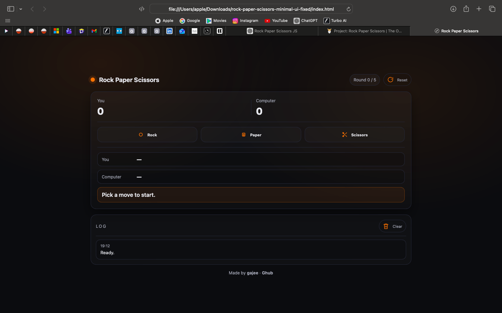
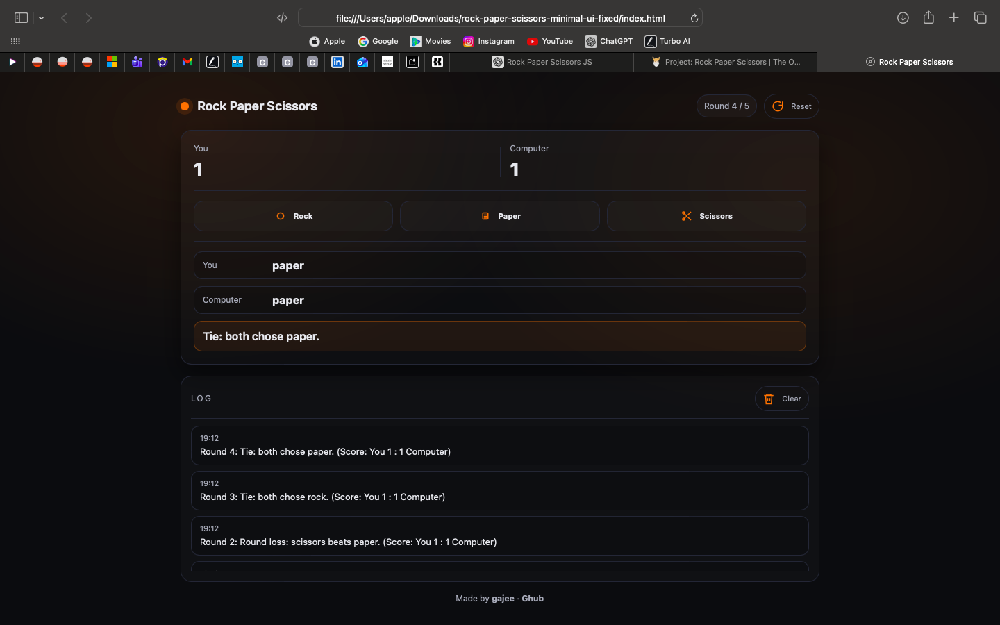

# Rock Paper Scissors

A minimal **Rock Paper Scissors** web game with a clean, modern interface.  
Built for clarity, simplicity, and learning.

**Made by gajee · Ghub**

---

## Preview

<table>
  <tr>
    <td align="center" width="50%">
      
       
      Main Screen
    </td>
    <td align="center" width="50%">
      
       
      Gameplay
    </td>
  </tr>
</table>

---

## About

This project is a modern take on the classic **Rock Paper Scissors** game, designed with a **minimal UI** and straightforward logic.

The goal of this project is to:
- Practice clean JavaScript fundamentals
- Build a simple interactive UI without frameworks
- Create a portfolio-ready beginner project
- Keep everything readable and easy to extend

---

## Features

- Classic Rock / Paper / Scissors rules
- 5-round match system
- Live score tracking
- Clear round results
- Game log history
- Reset & replay functionality
- Minimal black & white UI with orange accent
- SVG icons (no emojis)

---

## Tech Stack

- **HTML5**
- **CSS3**
- **Vanilla JavaScript**

No frameworks.  
No libraries.  
No build tools.

---

## How to Run

1. Clone or download this repository
2. Make sure all files are in the same folder
3. Open `index.html` in any modern browser
4. Click **Rock**, **Paper**, or **Scissors** to play
5. After 5 rounds, click **Reset** to start a new game

